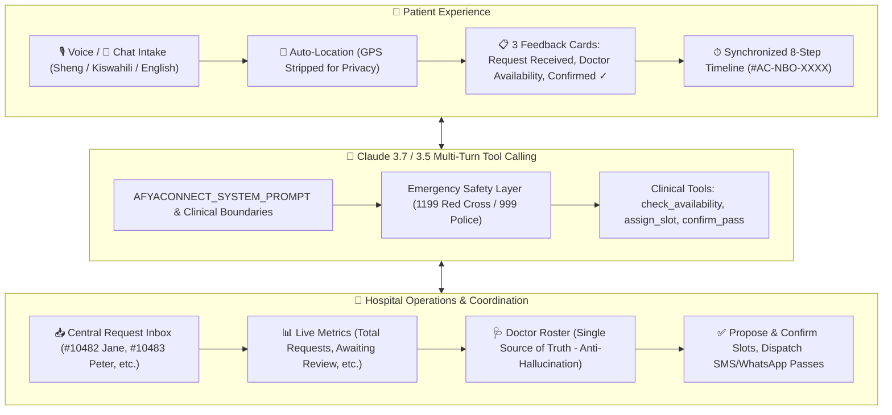

# AfyaConnect (Afya ya Jamii) 🇰🇪
### Bilingual Conversational Healthcare Access & Two-Sided Hospital Coordination Platform

AfyaConnect is an intelligent, location-aware, two-sided healthcare platform designed for urban and peri-urban Kenya (Nairobi Metropolis). It connects patients seeking care with hospital operations in real time.

Patients can call or chat in **English**, **Kiswahili**, or a natural **Sheng code-switch**, explain their symptoms, receive instant clinical guidance without diagnosing, discover nearby participating healthcare facilities, and book appointments. Meanwhile, hospital receptionists, triage officers, and doctors manage requests, duty rosters, and digital passes in a centralized dashboard.

---

## 🏛 System Architecture



---

## 🌟 Core Features

### 1. Patient Experience ("What happened to my request?")
- **Bilingual & Sheng Code-Switching**: Speaks natural conversational Kenyan dialects (e.g., *"Nimekuwa na maumivu ya tumbo for two days, na nahisi homa kali tangu jana"*).
- **Zero-Friction Auto-Location**: Resolves device coordinates into administrative sub-counties (e.g. *Westlands & Parklands Sub-County*) without asking *"Where are you located?"*.
- **Location Privacy**: Raw GPS coordinates are stripped before the LLM prompt to protect patient privacy.
- **Three Progressive Feedback Cards**:
  1. **Appointment Request Received**: Shows department, requested time, and status.
  2. **Doctor Availability**: Interactive card with verified doctor, room, time, and a one-click `[Confirm Appointment]` button.
  3. **Appointment Confirmed ✓**: Issues cryptographic digital token pass (`#AC-NBO-XXXX`), facility directions, and preparation notes.
- **Synchronized 8-Step Timeline**:
  1. `CALL / CHAT MADE`
  2. `Request received`
  3. `Hospital received request`
  4. `Department identified`
  5. `Doctor availability checked`
  6. `Time proposed`
  7. `Patient confirmed`
  8. `APPOINTMENT BOOKED`

### 2. Hospital Operations ("Who is requesting care and what needs to be handled?")
- **Central Request Inbox**: Every call or chat becomes a structured case (`CALL #10482` ➔ `PATIENT REQUEST` ➔ `HOSPITAL QUEUE` ➔ `DEPARTMENT` ➔ `DOCTOR` ➔ `APPOINTMENT`).
- **Real-Time Acuity Metrics**: Total Requests, Awaiting Review, Checking Availability, Confirmed, Rescheduling, Completed, and Urgent.
- **Doctor Roster as Single Source of Truth**: Claude never invents doctors or slots; all proposals originate from the hospital database.
- **Case Review Modal**: Staff can review verbatim audio transcripts, language preference, insurance coverage (SHA Active), assign doctors, propose slots, and dispatch SMS/WhatsApp digital passes.

### 3. Emergency Safety Layer
- Short-circuits life-threatening symptoms (cardiac arrest, respiratory distress, acute trauma) directly to Kenyan emergency hotlines:
  - **1199**: Kenya Red Cross Ambulance
  - **999 / 112**: National Police & Emergency Service

---

## 🚀 Quickstart: Running Locally

AfyaConnect runs out-of-the-box with **zero external paid keys required** using its built-in clinical decision engine.

### Prerequisites
- Python 3.10+
- Node.js 18+

### Setup & Launch in One Command

```bash
# 1. Clone repository
git clone https://github.com/Edwin420s/AfyaConnect.git
cd AfyaConnect

# 2. Install dependencies
npm install
pip install -r backend/requirements.txt

# 3. Launch full stack (Backend + Frontend)
./scripts/run_local.sh
```

### Local Endpoints
- **Frontend App**: `http://localhost:5173`
- **Backend API**: `http://127.0.0.1:8000`
- **Interactive Swagger Docs**: `http://127.0.0.1:8000/docs`
- **Health Check**: `http://127.0.0.1:8000/health`

---

## 🧪 Testing & Verification

AfyaConnect includes a comprehensive automated test suite covering unit, integration, and end-to-end communication tests:

```bash
# Run backend pytest suite
python3 -m pytest backend/tests -v

# Run Node.js frontend <-> backend E2E communication test
node scripts/test_frontend_backend_comm.mjs

# Build production bundle
npm run build
```

---

## 📡 API Reference Summary

| Method | Endpoint | Description |
| :--- | :--- | :--- |
| `GET` | `/health` | Service health & hotline status |
| `GET` | `/api/facilities` | List participating Kenyan healthcare facilities |
| `POST` | `/api/conversations/interact` | Patient chat/voice intake with Claude triage |
| `GET` | `/api/availability/check` | Real hospital doctor availability roster |
| `POST` | `/api/appointments/book` | Confirm appointment & generate `#AC-NBO-XXXX` pass |
| `GET` | `/api/hospital/dashboard` | Hospital receptionist dashboard & central inbox |
| `POST` | `/api/hospital/care-requests/:id/assign-doctor` | Assign department & doctor to request |
| `POST` | `/api/hospital/care-requests/:id/confirm-slot` | Propose/confirm consultation slot |
| `GET` | `/api/doctor/dashboard` | Doctor schedule & today's queue |
| `GET` | `/api/admin` | Platform oversight & audit trail |

---

## 📄 License
ISC License • Built for the Kenyan Healthcare Ecosystem.
